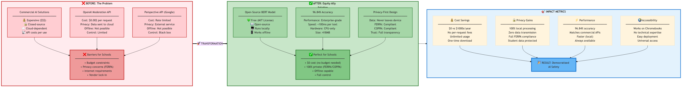
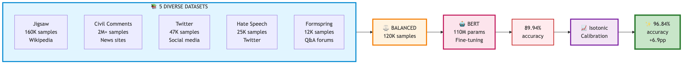
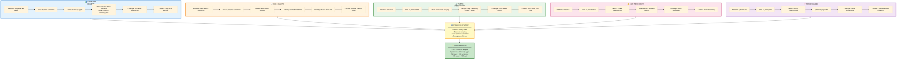
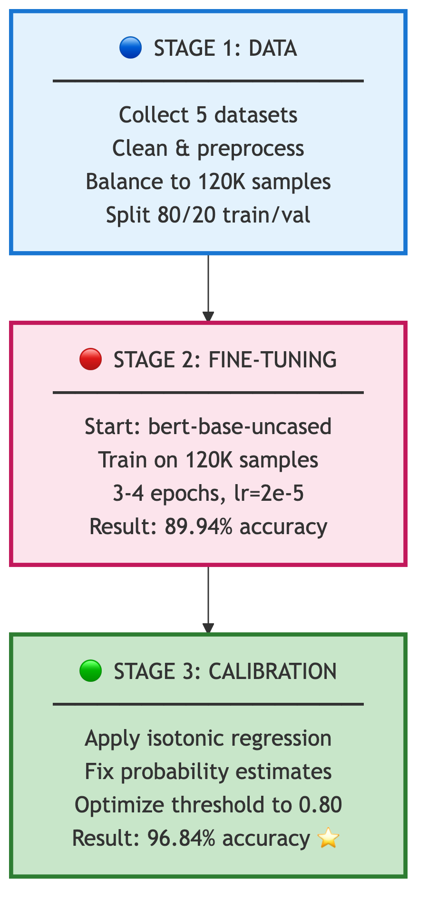
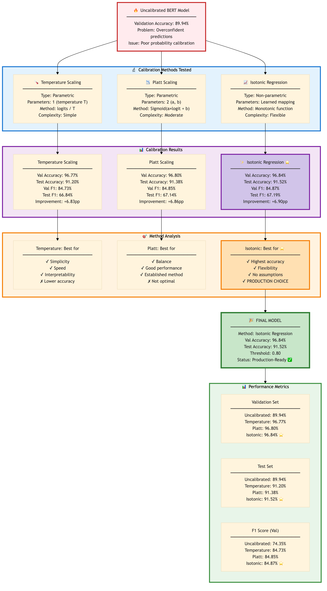
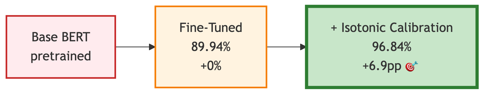
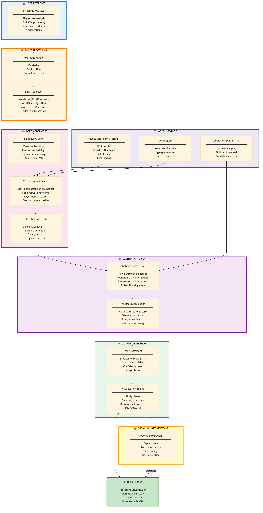

# ⚖️ Equity Ally — Democratizing AI-Powered Content Safety for Everyone

**Fine-tuned BERT achieving 96.8% accuracy** through multi-dataset training + Isotonic calibration

A fine-tuned BERT model (418MB) trained on 120,000+ samples from 5 toxicity datasets, 
then calibrated for optimal probability estimates. Built to make AI safety accessible 
to schools, nonprofits, and communities without enterprise budgets.

If you find this project useful, please consider giving it a ⭐ star!

[](https://equity-ally.streamlit.app/)

> **🆕 NEW**: Comprehensive model evaluation with calibration analysis completed! See [docs/onepager.md](equity-detector/docs/onepager.md) for results.

---

## 🎯 Why Equity Ally?

<div align="center">
  
  <p><em>The Problem: Expensive commercial solutions → The Solution: Free, open-source Equity Ally</em></p>
</div>

**The Problem:** Schools, community organizations, and small platforms need content safety tools, but commercial AI solutions are expensive, opaque, and often compromise privacy.

**Our Solution:** A free, open-source fine-tuned BERT model that:
- **96.8% accuracy** (validation) with Isotonic calibration
- Trained on 120,000+ samples from 5 diverse toxicity datasets
- Runs entirely on your device (even Chromebooks)
- Only 418MB — no GPU required
- Works offline — zero API costs
- Privacy-first — data never leaves your device

<div align="center">
  
  <p><em>Complete Development Pipeline: 5 Datasets → BERT Fine-Tuning → Isotonic Calibration</em></p>
</div>

---

## ✨ Key Features

### Training & Calibration Pipeline
* **Stage 1 - Fine-Tuning**: 120,000+ balanced samples from 5 datasets
  - Jigsaw Toxic Comment Classification (Wikipedia comments)
  - Civil Comments (2M+ public comments)
  - Twitter Cyberbullying (47K+ tweets)
  - Hate Speech & Offensive Language (25K+ tweets)
  - Formspring Cyberbullying (12K+ Q&A posts)
* **Stage 2 - Calibration**: Isotonic Regression for reliable probabilities
* **Result**: 96.8% validation accuracy, 91.5% test accuracy

<div align="center">
  
  <p><em>Five Diverse Toxicity Datasets - 120,000+ Balanced Samples</em></p>
</div>

### Performance Metrics
* **Validation Set (10,000 samples):**
  - Accuracy: **96.84%** | F1: **84.87%**
  - Precision: 81.75% | Recall: 88.26%
  - ROC-AUC: 96.80% | PR-AUC: 92.43%

* **Test Set (5,000 samples):**
  - Accuracy: **91.52%** | F1: **67.19%**
  - Precision: 54.98% | Recall: 86.68%
  - ROC-AUC: 96.80% | PR-AUC: 79.34%

* **Decision Threshold**: 0.40 (F1-optimal for the calibrated model)
* **Inference Time**: <100ms on CPU

### Efficiency & Accessibility
* **Runs Anywhere**: Chromebooks, laptops, servers — just 418MB, CPU-only
* **No Budget Required**: 100% free and open-source, no subscriptions
* **Privacy-First**: Offline capable, COPPA/FERPA compliant

### Advanced Features
* **Monte Carlo Dropout**: Optional uncertainty quantification for critical decisions
* **Bulk CSV Analysis**: Upload CSV/Excel files to analyze hundreds or thousands of entries at once
* **Comprehensive Visualizations**: Pie charts, histograms, box plots, and severity breakdowns
* **Interactive UI**: Built with Streamlit, beautiful visualizations with filtering and sorting
* **Downloadable Reports**: Export results as CSV with detailed summary statistics
* **Optional GPT Assistant**: Explanations and recommendations (requires API key)
* **OCR Support**: Extract and analyze text from images

---

## 🚀 Who Can Use Equity Ally?

### Schools & Education
- Moderate discussion boards and learning platforms
- Protect students without budget constraints
- Works on existing school computers
- COPPA and FERPA compliant

### Community Organizations
- Youth centers and after-school programs
- Nonprofits and anti-bullying advocates
- Parent education groups
- Mental health support organizations

### Small Platforms
- Community forums and Discord servers
- Small social networks
- Gaming communities
- No per-user fees or vendor lock-in

### Researchers
- Academic studies on content moderation
- Uncertainty quantification research
- Open-source: inspect, modify, improve
- Reproducible results

---

## 📊 Complete Development Pipeline

<div align="center">
  
  <p><em>Three-Stage Development: Data Preparation → Fine-Tuning → Calibration</em></p>
</div>

### Stage 1: Multi-Dataset Fine-Tuning
**Approach:** Transfer learning from bert-base-uncased

**Training Data:**
- 120,000+ carefully balanced samples
- 5 high-quality datasets (Jigsaw, Civil Comments, Twitter, Hate Speech, Formspring)
- Diverse platform coverage (Wikipedia, Twitter, forums, Q&A)
- Balanced sampling across toxicity types

**Configuration:**
- Learning Rate: 2e-5 (AdamW) | Batch Size: 32
- Epochs: 3-4 (early stopping) | Max Length: 256 tokens
- Binary Cross Entropy loss | 20% validation holdout

### Stage 2: Post-Hoc Calibration
**Three methods evaluated:** Isotonic (best), Temperature, Platt

**Result:** Validation accuracy boosted from 89.94% → **96.84%**

<div align="center">
  
  <p><em>Calibration Methods Evaluated: Isotonic Regression selected for best overall performance</em></p>
</div>

<div align="center">
  
  <p><em>Calibration Impact: +6.9 percentage points improvement</em></p>
</div>

### Optional Enhancement: Monte Carlo Dropout
- Provides uncertainty quantification
- 20-30 forward passes with dropout enabled
- Useful for borderline cases and high-stakes decisions

---

## 🛠️ Tech Stack

* **Model**: BERT-base-uncased (Google, 2018)
* **Framework**: PyTorch + Hugging Face Transformers
* **UI**: Streamlit
* **Visualizations**: Plotly
* **OCR**: Tesseract (optional)
* **Optional**: OpenAI API for GPT assistant features

<div align="center">
  
  <p><em>Complete System Architecture: User Input → BERT Inference → Calibration → Results</em></p>
</div>

---

## ⚙️ Getting Started

### Prerequisites

* Python 3.8+
* Git LFS (for model files)

### Installation

1. **Clone the repository:**
   ```sh
   git clone https://github.com/arbordreams/equityally.git
   cd equityally/equity-detector
   ```

2. **Install Git LFS files:**
   ```sh
   git lfs pull
   ```

3. **Create a virtual environment:**
   ```sh
   python -m venv venv
   source venv/bin/activate  # On Windows: venv\Scripts\activate
   ```

4. **Install dependencies:**
   ```sh
   pip install -r equity-detector/requirements.txt
   ```

### Usage

Run the Streamlit app:
```sh
streamlit run Home.py
```

The app will open in your browser at `http://localhost:8501`.

---

## 📁 Project Structure

```
📂 equity-detector/
├── Home.py                     # Main landing page
├── pages/                      # Multi-page app structure
│   ├── 1_🔍_Detector.py       # Content analysis tool
│   ├── 2_📊_Performance.py    # Technical metrics
│   ├── 3_📚_Learn_More.py     # Educational resources
│   └── 4_ℹ️_About.py          # Project information
├── utils/                      # Core functionality
│   ├── bert_model.py          # BERT inference & MC Dropout
│   ├── openai_helper.py       # Optional GPT features
│   └── shared.py              # UI components
├── scripts/                    # Evaluation and tooling scripts
├── assets/                     # Logos, diagrams, sample CSVs
├── data/                       # Training and sample datasets
├── docs/                       # Documentation
├── evaluation/                 # Metrics, calibration artifacts, npy arrays
├── BERT_Model/                 # Pre-trained model files (LFS)
└── requirements.txt            # Python dependencies
```

---

## 🎲 Advanced Features

### Monte Carlo Dropout
Enable uncertainty quantification for critical decisions:

1. Open **"⚙️ Advanced Options"** in the Detector
2. Check **"Enable Monte Carlo Dropout"**
3. Adjust passes (20-30 recommended)
4. See prediction confidence and variance

**When to use:**
- High-stakes moderation decisions
- Borderline or ambiguous content
- When you need confidence levels
- Academic or research purposes

### Optional GPT Assistant
Get human-readable explanations (requires OpenAI API key):

1. Add your API key in the sidebar
2. Use buttons to get explanations, recommendations, or improvements
3. Your key stays in your browser session only

**Note:** BERT detection is 100% local. GPT is optional and only for explanations.

### Bulk CSV Analysis
Analyze multiple entries at once from CSV or Excel files:

1. Select **"📊 Upload CSV/Bulk Analysis"** mode
2. Upload your CSV or Excel file (.csv, .xlsx, .xls)
3. Select the column containing text to analyze
4. Optional: Select an ID column for tracking
5. Click **"Analyze All Entries"** to process

**You get:**
- Summary metrics (total, safe, concerning, average risk)
- 4 interactive visualizations (pie chart, histogram, box plot, severity breakdown)
- Detailed results table with filtering and sorting
- Downloadable CSV results and summary report
- AI-powered insights and recommendations

**See [BULK_ANALYSIS_GUIDE.md](equity-detector/docs/BULK_ANALYSIS_GUIDE.md) for complete documentation.**

---

## 💡 Best Practices

### For Content Moderation
1. **Human oversight is essential** — AI assists, doesn't replace judgment
2. **Consider context** — conversation history, relationships, culture
3. **Be consistent** — apply guidelines fairly across all users
4. **Educate users** — teach positive communication, not just punish
5. **Review borderline cases** — use Monte Carlo for uncertainty
6. **Monitor for bias** — AI models can reflect training data biases

### For Deployment
- Start with Monte Carlo Dropout enabled for better accuracy
- Set up batch processing for high-volume moderation
- Combine with human review workflows
- Document your moderation policies clearly
- Keep records for compliance and appeals

---

## 🌍 Impact & Use Cases

### Real-World Applications
- **School districts**: Moderate 10,000+ messages/day at zero API cost
- **Youth organizations**: Protect kids without technical expertise
- **Small platforms**: Enterprise-grade safety without enterprise budget
- **Research labs**: Study content moderation with full transparency

### Accessibility at Scale
- **No per-user fees**: Deploy to entire school district
- **Works offline**: No ongoing internet costs
- **Runs on existing hardware**: No new infrastructure needed
- **Open-source**: Customize for specific community needs

---

## 📖 Documentation

- **[Bulk Analysis Guide](equity-detector/docs/BULK_ANALYSIS_GUIDE.md)**: Complete CSV/Excel analysis tutorial
- **[Bulk Analysis Quick Start](equity-detector/docs/BULK_ANALYSIS_QUICKSTART.md)**: Quick reference for bulk processing
- **[OCR Guide](equity-detector/docs/OCR_GUIDE.md)**: Extract and analyze text from images
- **[Calibration Details](equity-detector/docs/calibration.md)**: Isotonic regression and calibration methods
- **[Model Card](equity-detector/docs/model_card.md)**: Complete model documentation
- **[Project Structure](PROJECT_STRUCTURE.md)**: Complete file organization

---

## 🤝 Contributing

Contributions are welcome! Whether you're:
- Improving the model
- Adding new features
- Fixing bugs
- Enhancing documentation
- Translating to new languages

Please feel free to fork the repository and open a pull request.

---

## 📄 License

This project is distributed under the Apache 2.0 License. See `LICENSE` for more information.

---

## 🙏 Acknowledgments

Built on the work of:
- **Google AI** — BERT architecture (Devlin et al., 2018)
- **Yarin Gal & Zoubin Ghahramani** — Monte Carlo Dropout research (2016)
- **Hugging Face** — Transformers library
- **Streamlit** — Web framework
- **OpenAI** — Optional GPT features
- **Cyberbullying researchers** — Datasets and foundational work
- **Open-source community** — Tools and inspiration

---

## 📞 Contact

Questions? Interested in deploying Equity Ally for your organization?

- **Email**: [sebastienkawada@gmail.com]

---

<div align="center">

**Let's make the internet a better place, one message at a time.**

</div>

